<!--
 * @Description: 
 * @Author: qianwan
 * @Date: 2023-11-01 14:33:32
 * @LastEditTime: 2023-11-08 17:41:33
 * @LastEditors: qianwan
-->
# Manual of libspi

A part of libqw   
library version: 1.0
document version: 1.0

---
## Overall
&emsp;We designed libspi to overcome hardware differences. libspi is servered as a spi master component. libspi comprises two key components: an abstract layer that defines I/O standards for drivers and an instance layer that accommodates various hardware variations.
<div align=center></div>

&emsp;The abstract layer is named as libspi-a-*version*.h, where the *'version'* shouled be selected correctly. The instance layer is named as libspi-i-*feature*-*version*.hpp, where the *'feature'* represents information about the platform, and the *'version'* markes the software package.

## Abstract layer
&emsp;The abstract layer defines basic functions for applications that wish to use libspi as a component to control physical spi ports. 
&emsp;The abstract layer includes a namespace called SPIA and a pure virtual class named cSPIA. Applications should add a class pointer with the type  cSPIA and set the pointer to point to a childre class in the instrance layer.  
&emsp;Here is a lists of functions decleared in the abstract layer within the class cSPIA:

```C
        /*Check initied status */
        virtual uint8_t CheckInitializationStatue()
        /*Enable CS# GPIO*/
        virtual void CS_Enable() = 0;
        /*Disable CS# GPIO*/
        virtual void CS_Disable() = 0;
        /*Exchange one byte with slaver*/
        virtual uint8_t ExchangeByte(uint8_t data) = 0;
        /*Exchange multi bytes with slaver*/
        virtual uint8_t ExchangeByte(uint8_t *pdatatx, uint8_t *pdatarx, uint32_t num) = 0;
        /*Send multi bytes to slaver*/
        virtual uint8_t WriteByte(uint8_t *pdata, uint32_t num) = 0;
        /*Read multi bytes from slaver*/
        virtual uint8_t ReadByte(uint8_t *pdata, uint32_t num) = 0;
        /*Send multi bytes to slaver through DMA*/
        virtual uint8_t TransmitDMA(uint8_t *pdata, uint32_t num){return 0x01;}
        /*Receive multi bytes from slaver through DMA*/
        virtual uint8_t ReceiveDMA(uint8_t *pdata, uint32_t num){return 0x01;}
        /*Exchange multi bytes with slaver through DMA*/
        virtual uint8_t TransmitReceiveDMA(uint8_t *pdatatx, uint8_t *pdatarx, uint32_t num){return 0x01;}
        /*DMA-RX-CHN IRQ function that need to be set in interrupt call back function*/
        virtual uint8_t ReceiveDMAIRQ(){return 0x01;}
        /*DMA-TX-CHN IRQ function that need to be set in interrupt call back function*/
        virtual uint8_t TransmitDMAIRQ(){return 0x01;}
        /*SPI IRQ function that need to be set in interrupt call back function*/
        virtual uint8_t SPIIRQ(){return 0x01;}
```

## Instance layer
&emsp;The instance layer is subclass cSPI that inherits from the parent class SPIA in abstract layer.

#### libspi-i-common
&emsp;The libspi-i-common-*version*.hpp implements a layer based on the STM32 Low Layer(LL) API and accomodates differences between the STM32 SPI controllers. DMA features can be cropped by config definations in libspi-i-common.
&emsp;To straighten differences between LL APIs and maximize optimization, function templates are used in libspi-i-common. Users need to instantiate these templates first. Below is a list of these templates and a comparison list.


###### Additional use DMA transmit and recieve
```C++
    typedef uint32_t (FUNC_DMA_FLAG_CHECK)(DMA_TypeDef *DMAx);
    typedef void (FUNC_DMA_FLAG_OPERATE)(DMA_TypeDef *DMAx);
    typedef void (FUNC_DMA_CHN_SET)(DMA_TypeDef *DMAx, uint32_t CHNx);

    /*Check DMA-TX-CHN TC flag*/
    FUNC_DMA_FLAG_CHECK     funcDMA_CheckFlag_TX_TC;
    /*Clear DMA-TX-CHN TC flag*/
    FUNC_DMA_FLAG_OPERATE   funcDMA_ClearFlag_TX_TC;
    /*Clear DMA-TX-CHN TE flag*/
    FUNC_DMA_FLAG_OPERATE   funcDMA_ClearFlag_TX_TE;
    /*Check DMA-RX-CHN TC flag*/ 
    FUNC_DMA_FLAG_CHECK     funcDMA_CheckFlag_RX_TC;
    /*Clear DMA-RX-CHN TC flag*/
    FUNC_DMA_FLAG_OPERATE   funcDMA_ClearFlag_RX_TC;
    /*Clear DMA-rX-CHN TE flag*/
    FUNC_DMA_FLAG_OPERATE   funcDMA_ClearFlag_RX_TE;
    /*Enable DMA transmit stream*/ 
    FUNC_DMA_CHN_SET        funcDMA_EnableCHN;
    /*Disable DMA transmit stream*/ 
    FUNC_DMA_CHN_SET        funcDMA_DisableCHN;
```
Comparison table:
|  Function Template   | Really Function Name |
|  ----  | ----  |
| funcDMA_CheckFlag_TX_TC  | LL_DMA_IsActiveFlag_TCx |
| funcDMA_ClearFlag_TX_TC  | LL_DMA_ClearFlag_TCx |
| funcDMA_ClearFlag_TX_TE  | LL_DMA_ClearFlag_TEx |
| funcDMA_CheckFlag_RX_TC  | LL_DMA_IsActiveFlag_TCx |
| funcDMA_ClearFlag_RX_TC  | LL_DMA_ClearFlag_TCx |
| funcDMA_ClearFlag_RX_TE  | LL_DMA_ClearFlag_TEx |
| funcDMA_EnableCHN     | LL_DMA_EnableStream |
| funcDMA_DisableCHN    | LL_DMA_DisableStream |

## Example

#### Basic functions
version: libspi-i-common-1.0
Here is a simple example to demonstrate how to use the basic APIs of libspi.

```C++
#include "main.h"
#include "libspi-i-common-1.0.hpp"
using namespace SPI;

class cSensor{
    protected:
        /*Use libspi as a component*/
        SPIA::cSPIA* _pspi;
    public:
        explicit cSensor(SPIA::cSPIA* spi):_pspi(spi){}
        
        /*User function that use libspi api*/
        void writeReg(uint8_t addr, uint8_t* data, uint32_t num) const
        {
            /*Choose chip*/
            _pspi->CS_Enable();
            /*Set address*/
            _pspi->ExchangeByte(addr);
            /*It will be ok if we put same buffer address*/
            _pspi->ExchangeByte(data,data,num);
            _pspi->CS_Disable();
            dosth();
        }
};

cSensor* mySensor;
[[noreturn]] void myThread1(ULONG initial_input)
{
    /*Inital a basic class spi*/
    cSPIBasic mySpi(
       SPI1,
       SPI1_CS_GPIO_Port,
       SPI1_CS_Pin,
       480000);

    /*Check status*/
    if(mySpi.CheckInitializationStatus()!=1)
    {Error_Handler();}

    /*Instantiate mySensor*/
    cSensor sensor(&mySpi);
    mySensor = &sensor;

    while(true){
        /*Do something*/
        mySensor->writeReg(0x01,pbuftx,2);
        sleep_ms(10);
    }
}

```

#### DMA functions
version: libspi-i-common-1.0
Here is a simple example to demonstrate how to use the DMA APIs of libspi.

```C++
/********demo.h********/
#pragma once
#include "main.h"

#ifdef __cplusplus
extern "C" {
    void Task_Init(void);
    void DMA1_Stream0_IRQHandler(void);
    void DMA1_Stream1_IRQHandler(void);
    void SPI1_IRQHandler(void);
}
#endif
```

```C++
/********demo.cpp********/
#include "libspi-i-common-1.0.hpp"
using namespace SPI;

/*Buffer of send and receive*/
uint8_t txbuf[4096];
uint8_t rxbuf[4096];

SPIA::cSPIA* mySensor;
[[noreturn]] void myThread2(ULONG initial_input)
{
    /*Instantiate class*/
    cSPI<
        LL_DMA_IsActiveFlag_TC1,    \
        LL_DMA_ClearFlag_TC1,       \
        LL_DMA_ClearFlag_TE1,       \
        LL_DMA_IsActiveFlag_TC0,    \
        LL_DMA_ClearFlag_TC0,       \
        LL_DMA_ClearFlag_TE0,       \
        LL_DMA_EnableStream,        \
        LL_DMA_DisableStream
    >mySpi(
            SPI1,
            SPI1_CS_GPIO_Port,
            SPI1_CS_Pin,
            480000,
            DMA1,LL_DMA_STREAM_1,
            DMA1,LL_DMA_STREAM_0
    );

    /*Check status*/
    if(mySpi.CheckInitializationStatus()!=2)
    {Error_Handler();}

    /*Instantiate mySensor*/
    mySensor = &mySpi;

    while(true)
    {
        /*Exchange data through DMA*/
        mySensor->CS_Enable();
        mySensor->TransmitReceiveDMA(txbuf,rxbuf,4096);
        sleep_ms(10);
    }
}

/*IRQ of receive*/
void DMA1_Stream0_IRQHandler(void)
{
    mySensor->ReceiveDMAIRQ();
}

/*IRQ of send*/
void DMA1_Stream1_IRQHandler(void)
{
    mySensor->TransmitDMAIRQ();
}

/*IRQ of spi*/
void SPI1_IRQHandler(void)
{
    mySensor->SPIIRQ();
    mySensor->CS_Disable();
}
```
